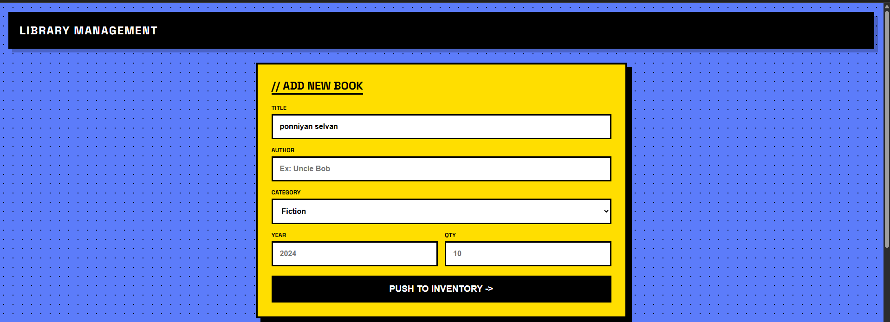
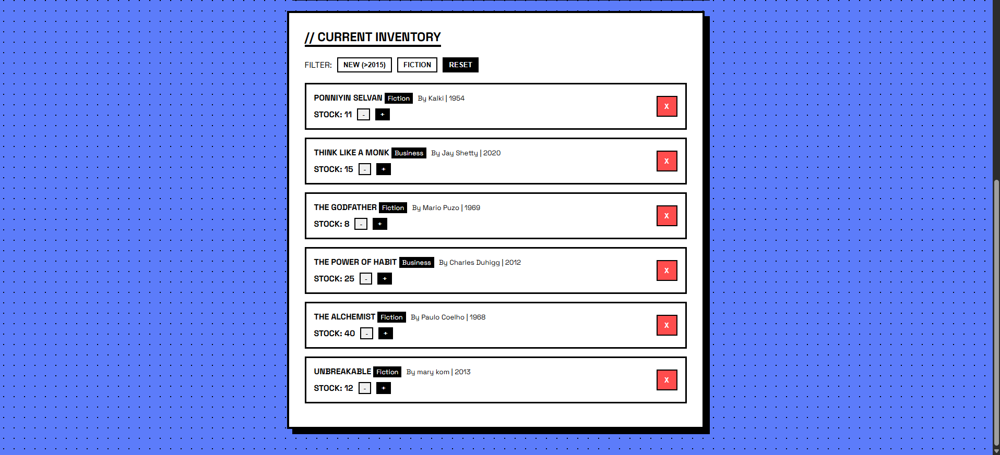
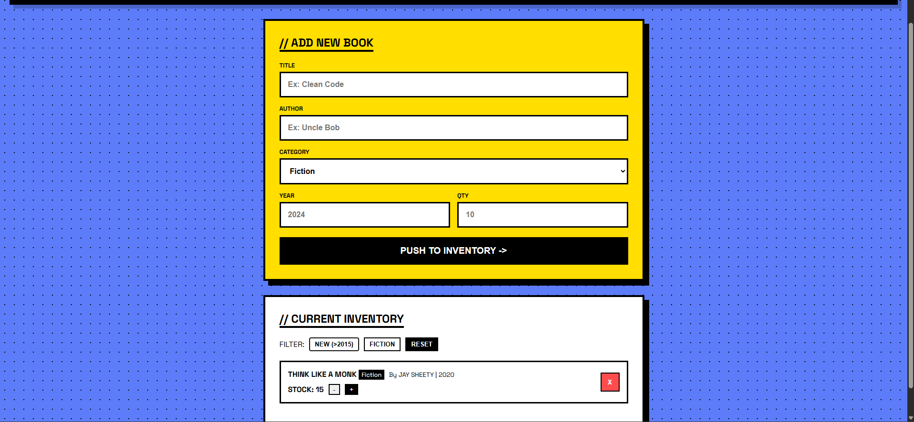
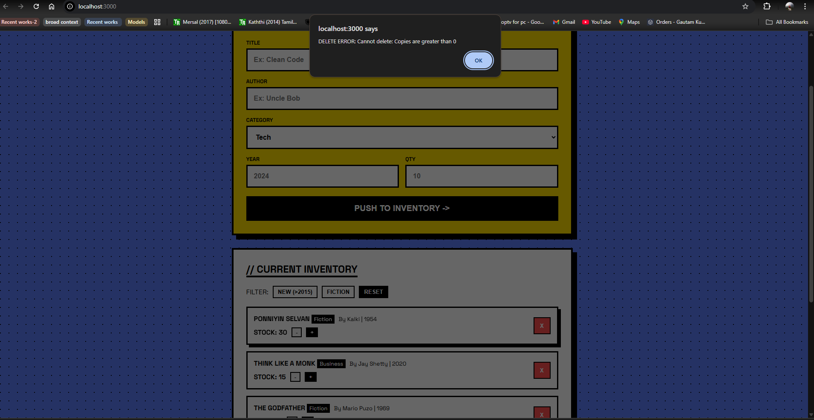
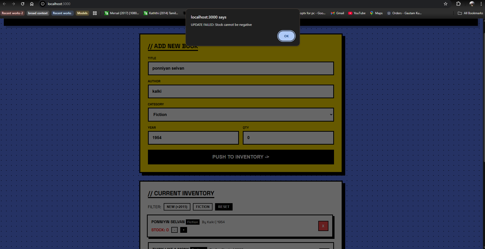

#  Library Inventory System

## Project Overview
A Neo-Brutalist style web application for managing library inventory. This project demonstrates full CRUD operations, advanced filtering, and strict error handling using Node.js, Express, and MongoDB.

## Features & Conditions Met

### 1. Schema & Database
- **Database:** MongoDB (`libraryDB`)
- **Collection:** `books`
- **Schema Fields:** `title`, `author`, `category`, `publishedYear`, `availableCopies`.

### 2. CRUD Operations
- **Create:** Users can add new books via the input panel.
- **Read:**
  - View all books.
  - **Filter:** "NEW (>2015)" button fetches only recent publications.
  - **Filter:** "FICTION" button filters by category.
- **Update:**
  - **Stock Control:** Incremental `[+]` and `[-]` buttons to adjust inventory.
- **Delete:**
  - **Logic:** Books can ONLY be deleted if `availableCopies` is 0.

### 3. Error Handling
- **Negative Stock:** Backend prevents stock from going below 0.
- **Invalid Delete:** Backend rejects deletion requests for books with stock > 0.
- **Book Not Found:** Handles requests for non-existent IDs gracefully.

## Tech Stack
- **Frontend:** HTML5, CSS3 (Neo-Brutalist Design),  JS
- **Backend:** Node.js, Express.js
- **Database:** MongoDB

## 📸 Testing & Validation (Screenshots)

### 1. Create & Read (Full List)
**Condition Met:** "Insert minimum 7 books" & "Read All books"
*Below: The dashboard showing all 7+ items retrieved from the database.*

### 2. Filtering Logic
**Condition Met:** "Books after year 2015" & "Books by category"
*Below: The result after clicking the "NEW (>2015)" button. Only recent books are shown.*

### 3. Delete Restriction (Error Handling)
**Condition Met:** "Remove book if copies = 0"
*Below: The system prevents deletion because the book still has stock.*

### 4. Negative Stock Prevention (Error Handling)
**Condition Met:** "Negative stock prevention"
*Below: The system prevents decreasing stock below zero.*

---