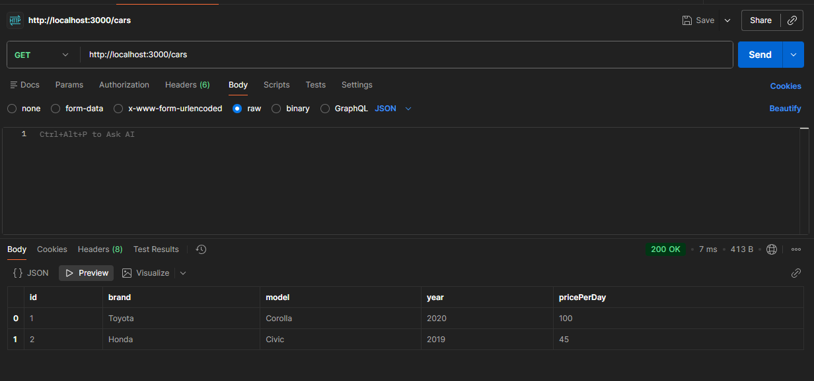

# 🚗 Rental Car Management API

A simple **CRUD API** for managing rental cars, built with **Node.js**, **Express**, and **JSON file storage**.

This project allows you to:

* **Create**: Add new cars to the inventory.
* **Read**: Retrieve a list of all cars or find a specific car by ID.
* **Update**: Update car details (PUT) or specific properties (PATCH).
* **Delete**: Remove a car from the system.

---

## 🗂 Folder Structure

```
Rental Car Management/
│── app.js                
│── package.json          
│── node_modules/         
│
├── Controllers/
│   └── controller.js     
│
├── Routes/
│   └── routes.js         
├── data/
│   └── cars.json         
│
└── screenshots/          
    ├── post-request.png
    └── put-request.png


---
## 🚀 Getting Started

1. Install dependencies:

```bash
npm init -y
npm install express
```

2. Run the API:

```bash
node app.js
```

The API will run on `http://localhost:3000`.

---

## 📌 API Endpoints

| Method | Endpoint  | Description                      |
| ------ | --------- | -------------------------------- |
| GET    | /cars     | Get all cars                     |
| GET    | /cars/:id | Get car by ID                    |
| POST   | /cars     | Add a new car                    |
| PUT    | /cars/:id | Update entire car                |
| DELETE | /cars/:id | Delete a car                     |

---

# 🖼 Screenshots

Here are the results from testing the API in Postman:
### GET Request Result

### PUT Request Result

### POST Request Result

### DELETE Request Result


---


